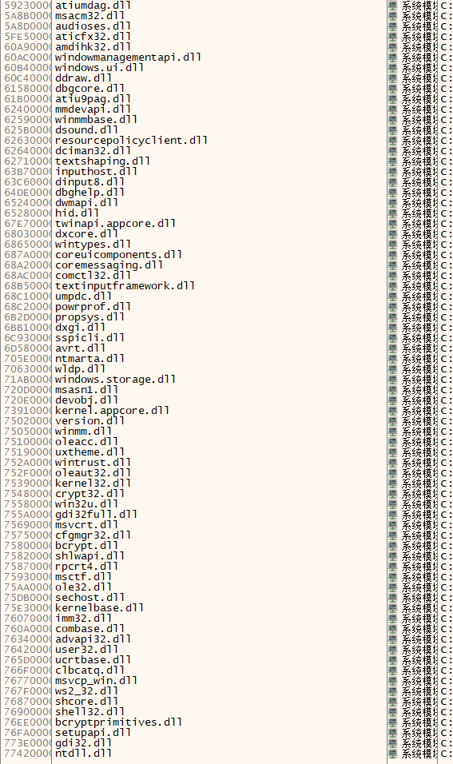

# 鎖-くさり- AI机翻补丁

这是Leaf社鎖-くさり-的AI翻译补丁，使用Claude-3-sonnet进行翻译。

本补丁仅供交流学习，请在购买游戏正版的基础上使用本补丁。

## 使用说明

从dlls文件夹中选择一个dll放入游戏目录下，然后将本补丁中其他文件也放入游戏目录下即可。无需转区运行。（如果嫌弃标题乱码那就转区吧）

## 已知问题

目前发现有以下问题：

- 选项未能提取到，未翻译
- 部分句子没能正常显示翻译（原因未知、出现随机） 对于这些句子，在backlog中能正常看到译文。
- 原本的字体是内置的，不支持简体中文。现在的字体是我重绘的，可能不太好看。

## 异常处理

如果发现没有出现译文，可以按照以下步骤进行处理并反馈：

- 先依次尝试所给的几个dll
- 依次尝试将dll更名为下图中所示意的名称，然后启动游戏，如果游戏运行时出现了弹窗，将这个dll的名称反馈给我，我会发布新的补丁。

  

## 致谢

感谢 [朝比奈真冬](https://fan2d.top/users/363133) 大佬赞助的额度！

本项目使用了以下开源工具：

Galtransl：[xd2333/GalTransl: 支持GPT-3.5/GPT-4/Newbing/Sakura等大语言模型的Galgame自动化翻译解决方案 Automated translation solution for visual novels supporting GPT-3.5/GPT-4/Newbing/Sakura (github.com)](https://github.com/xd2333/GalTransl)

在此致以感谢！
